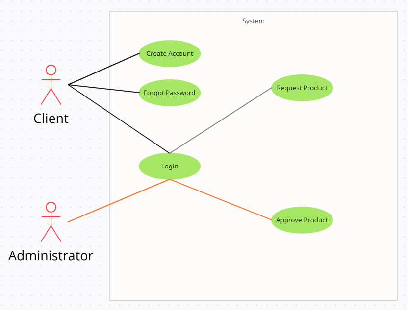

# Regov-enterprise - Pop quiz 7

## Main Feature

- Login Module
  - Sign In
  - Sign Out
  - Sign Up
  - Forgot Password

- Client Module
  - View List Product
  - Create Request Product

- Admin Module
  - View List Product
  - Approve Product

# Technologies

- UI Library: Ant design + React OTP Input
- CSS Library: SCSS + CSS module
- State Management: React Context
- Router: React Router

# Folder Structure

```shell
|--src # Main Logic Code
|   |--- enum # Share Enums
|   |--- components # Share UI
|   |--- context # State Management
|   |--- interface # Interface
|   |--- mock # Mock data
|   |--- module_styles # Share module styles
|   |--- page # Page view
|   |--- router # Config router direct to page
|   |--- utils # Share function
|   |--- App.tsx
|   |--- index.css # Reset css
|   |--- index.tsx
|-- .env.example # example node env variables
|-- .eslintrc.yml # config eslint
```

## Set up virtual environment

```
yarn install
```

## Run app

```
yarn start
```

Runs the app in the development mode.
Open http://localhost:3000 to view it in your browser.


## Build app

```
yarn build
```

Builds the app for production to the `build` folder.
It correctly bundles React in production mode and optimizes the build for the best performance.
The build is minified and the filenames include the hashes.
Your app is ready to be deployed!

## UserCase

